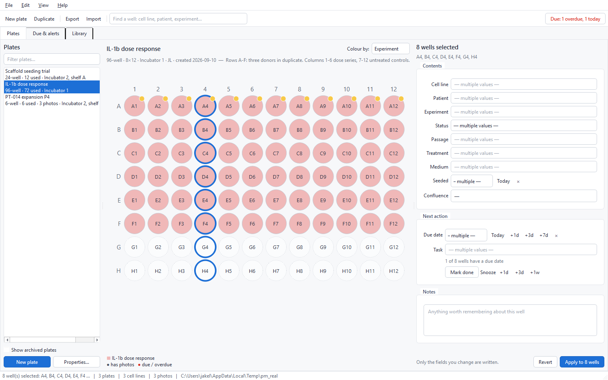
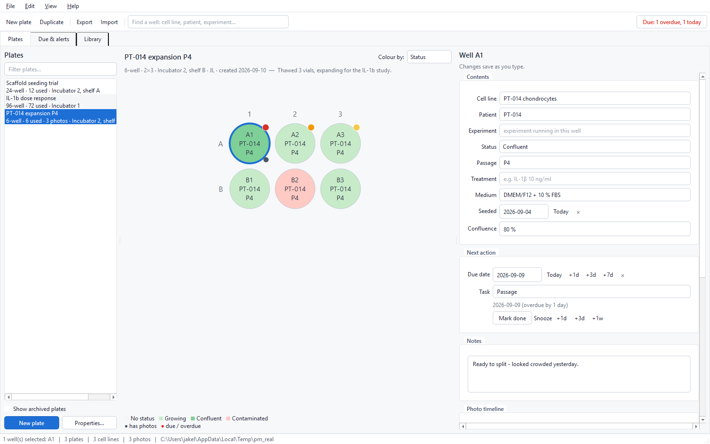
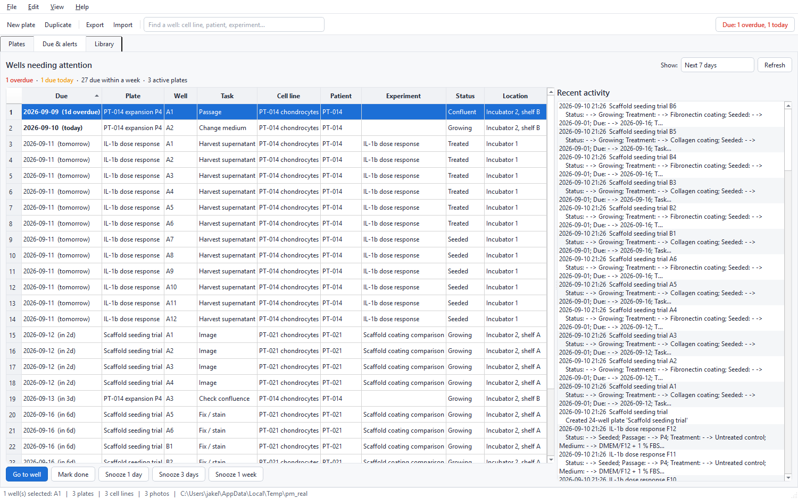

# Plate Manager

Cell-culture plate tracking for lab work: virtual plates, a record for every
well, photo timelines, and due dates that actually remind you.

Runs on **Windows and macOS** (and Linux) from the same code — Python + Qt
(PySide6), with all data in one folder you can copy, sync or export.



## What it does

**Plates and wells**
- Create virtual plates in the usual formats — dish/flask, 4, 6, 12, 24, 48, 96,
  384-well — or a custom number of rows and columns.
- Click, drag, shift-click, or click a row/column header to select wells;
  everything in the editor then applies to the whole selection, so filling a
  column takes one edit.
- Per well: cell line, patient/donor ID, experiment, status, passage, treatment,
  medium, seeding date, confluence %, due date + task, and free-text notes.
- Colour the plate by status, experiment, cell line, patient or due date. Badges
  show which wells have photos and which are due.
- Every change is logged, so each well has a history you can read back.



**Photos with dates**
- Drag image files onto a well's photo strip, use *Add photos…*, or paste
  straight from the clipboard (handy with microscope software).
- Dates come from the image's EXIF data where available, otherwise the file
  date — and stay editable, with optional captions.
- Photos are sorted by date, so a well's strip *is* its visual timeline; the
  viewer steps through it with the arrow keys.

**Due dates and reminders**
- Give a well a due date and a task ("Change medium", "Passage", "Harvest"…).
- The **Due & alerts** tab lists everything due or overdue across all plates,
  with *Mark done* and snooze buttons.
- On opening (and periodically while running) the app shows a summary
  notification from the system tray / menu bar. Overdue counts appear in the
  toolbar and next to each plate in the list.



**No typing the same thing twice**
- Cell lines, patient IDs, experiments, media, treatments, passages, tasks,
  locations and owners all suggest what has been used before — substring match,
  case-insensitive.
- New values are added to the library automatically the first time you type them.
- Naming a cell line and a patient together links them, so the next time you type
  that cell line the patient fills itself in.
- The **Library** tab is where you tidy up: add a diagnosis, link a line to a
  donor, rename a line (every well follows), retire an old experiment.

**Your data, in one folder**
- Everything lives in one data folder: `plates.db` plus `photos/`.
- *File ▸ Export bundle* writes a single `.plmz` file (database + photos).
- *File ▸ Import bundle* on the other computer either **merges** it (adds what is
  missing, keeps whichever copy of a well was edited more recently — safe to
  repeat) or **replaces** everything, keeping a timestamped backup first.
- Or point both machines at the same synced folder (OneDrive/Dropbox/network
  share) in *Settings* — one at a time.

## Install and run

Requires Python 3.10 or newer.

On macOS and Linux use `python3` (on macOS, plain `python` is often missing or an
old system build); on Windows use `py`.

```bash
git clone https://github.com/NonayMete/PlateManager.git && cd PlateManager
python3 -m venv .venv
```

Activate the environment — macOS/Linux: `source .venv/bin/activate`, Windows:
`.venv\Scripts\activate` — then:

```bash
pip install -r requirements.txt
python run.py
```

The install is per-environment, so do this once on each computer. Run the app
with the same Python you installed into: inside the activated `.venv`, plain
`python run.py` is that Python.

To see it with sample data in it first:

```bash
python run.py --demo
```

Other options: `--data-dir PATH` (use a different data folder for this run),
`--version`.

### As an installed command

```bash
pip install .
plate-manager
```

### Building a double-clickable app

Neither platform needs Python installed for the built app, but you must build
on the platform you are targeting (a Windows `.exe` has to be built on Windows).

```bash
pip install pyinstaller
python build_app.py
```

The result lands in `dist/` — `Plate Manager.exe` on Windows, `Plate Manager.app`
on macOS. Data is *not* stored inside the app, so upgrading is just replacing it.

## If it will not start

**`ModuleNotFoundError: No module named 'PySide6'`** — the packages are not
installed for the Python that ran the app. Either the `pip install` step has not
been done on this computer, or the app is being run with a different Python than
the one installed into (a double-clicked file, an IDE's interpreter, or a shell
where the `.venv` is not activated). Activate the environment and install:

```bash
cd PlateManager
python3 -m venv .venv
source .venv/bin/activate
pip install -r requirements.txt
python run.py
```

Running `python run.py` now prints these instructions itself instead of a
traceback, including the exact interpreter it was started with.

**`error: externally-managed-environment`** (macOS with Homebrew Python, or
recent Linux) — pip is refusing to install into the system Python. Create and
activate the `.venv` above and install there; never use `--break-system-packages`
for this.

**Python too old** — 3.10 or newer is needed. Check with `python3 -V`. macOS
ships an old build; install a current one from [python.org](https://www.python.org/downloads/)
or with `brew install python`.

**macOS says the built app "cannot be opened because the developer cannot be
verified"** — the `.app` from `build_app.py` is unsigned. Right-click it and
choose *Open*, then *Open* again; macOS remembers the choice.

## Where the data lives

| Platform | Default folder |
| --- | --- |
| Windows | `%LOCALAPPDATA%\ArthroLase\Plate Manager` |
| macOS | `~/Library/Application Support/Plate Manager` |
| Linux | `~/.local/share/Plate Manager` |

Change it in *Settings*, override it per run with `--data-dir`, or set
`PLATE_MANAGER_HOME`. *Help ▸ Where is my data?* shows the current path;
*File ▸ Open data folder* opens it.

Back it up by copying the folder, or by exporting a bundle.

## Keyboard shortcuts

| | |
| --- | --- |
| `Ctrl/Cmd+N` | New plate |
| `Ctrl/Cmd+F` | Find a well |
| `Ctrl/Cmd+A` | Select all wells |
| `Ctrl/Cmd+Shift+C` / `+V` | Copy a well's contents / paste into the selection |
| `Del` | Clear the selected wells |
| `Ctrl/Cmd+E` / `+I` | Export / import a bundle |
| `F5` | Refresh |
| arrows, shift+arrows | Move / extend the well selection |
| arrows in the photo viewer | Step through the timeline |

## How it is put together

| | |
| --- | --- |
| `plate_manager/db.py` | SQLite schema; every row carries a `uid` so bundles can be merged |
| `plate_manager/repo.py` | all data access (`Store`); creates lookups from typed names |
| `plate_manager/models.py` | plate formats, statuses, date helpers |
| `plate_manager/photos.py` | photo import, EXIF dates, thumbnail cache |
| `plate_manager/archive.py` | `.plmz` export, merge and replace |
| `plate_manager/notify.py` | tray icon, due-date notifications |
| `plate_manager/ui/` | the Qt interface (plate grid, well editor, dashboard, library) |

Run the tests with:

```bash
python -m pytest tests -q
```

## A note on patient data

Use de-identified codes for patients/donors. The app is a lab tracking tool, not
a clinical record, and stores whatever you type in a plain file on your computer.
